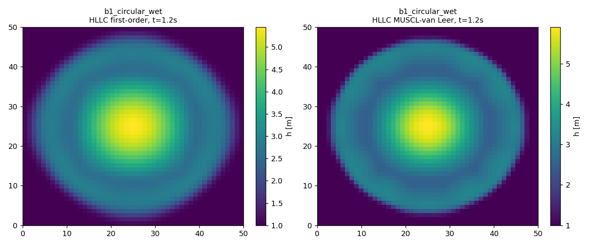
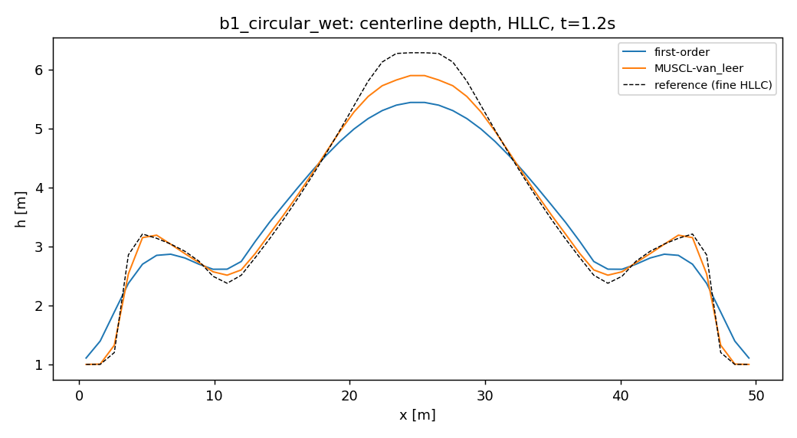
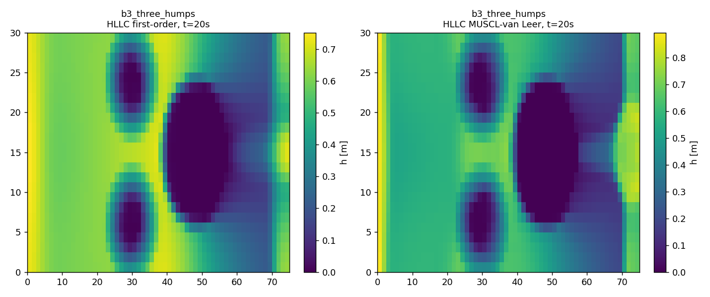
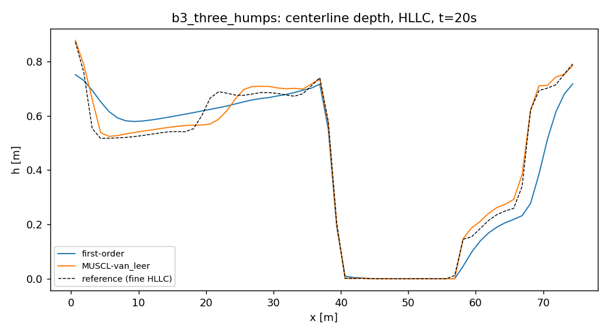
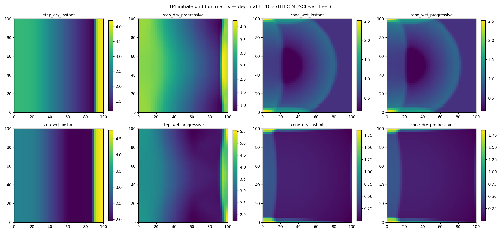

# 2D benchmark comparison (classical schemes)

Device: cuda. Generated by `experiments/run_classical.py` from `configs/classical_sweep.yaml`. Errors are vs a fine-grid HLLC MUSCL-van Leer self-convergence reference, at the final output time, L1/L2 over cell area. Runtimes are wall-clock for the full run.

## b1_circular_wet  (N=48, reference N=96)

| scheme | reconstruction | L1(h) | L2(h) | L1(speed) | mass drift | wall t [s] | steps |
|---|---|---|---|---|---|---|---|
| hll | first-order | 5.457448e+02 | 1.516287e+01 | 1.539949e+03 | 2.12e-04 | 0.2655 | 32 |
| hll | MUSCL-van_leer | 1.479979e+02 | 4.810957e+00 | 3.254443e+02 | 4.90e-10 | 0.3258 | 34 |
| hllc | first-order | 5.323195e+02 | 1.476275e+01 | 1.485052e+03 | 1.35e-04 | 0.5076 | 32 |
| hllc | MUSCL-van_leer | 1.699476e+02 | 5.384673e+00 | 3.832719e+02 | 1.67e-10 | 0.4455 | 34 |

## b3_three_humps  (N=60, reference N=90)

| scheme | reconstruction | L1(h) | L2(h) | L1(speed) | mass drift | wall t [s] | steps |
|---|---|---|---|---|---|---|---|
| hll | first-order | 1.072589e+02 | 3.557002e+00 | 6.978854e+02 | 2.22e-16 | 1.8494 | 212 |
| hll | MUSCL-van_leer | 4.642229e+01 | 1.470582e+00 | 2.998450e+02 | 0.00e+00 | 2.2401 | 232 |
| hllc | first-order | 1.087245e+02 | 3.646715e+00 | 6.980768e+02 | 2.22e-16 | 2.6328 | 217 |
| hllc | MUSCL-van_leer | 4.340321e+01 | 1.378640e+00 | 2.522923e+02 | 0.00e+00 | 3.2046 | 234 |

## B4 initial-condition matrix (HLLC MUSCL-van Leer, N=48)

Isolates the effect of the initial/breach configuration with a fixed high-quality scheme. 'progressive' opens the dam linearly over T_b=2 s; 'instant' removes it at t=0.

| case | mass drift | wall t [s] | steps |
|---|---|---|---|
| step_dry_instant | 2.22e-16 | 1.6706 | 122 |
| step_dry_progressive | 0.00e+00 | 1.7221 | 126 |
| cone_wet_instant | 0.00e+00 | 1.014 | 78 |
| cone_wet_progressive | 0.00e+00 | 1.0445 | 78 |
| step_wet_instant | 4.44e-16 | 1.3528 | 103 |
| step_wet_progressive | 0.00e+00 | 1.4775 | 110 |
| cone_dry_instant | 0.00e+00 | 1.1655 | 90 |
| cone_dry_progressive | 0.00e+00 | 1.3959 | 90 |

## Notes

- **Scheme ordering** (accuracy at fixed reconstruction) is the paper's central classical result: HLLC < HLL < Rusanov in L1(h) error, the gap widening with limiter sharpness. Superbee is sharpest but most oscillatory; van Leer is the robust default.
- **Mass conservation**: closed-domain cases (B2, B3, B4) drift at round-off; B1 is transmissive so its 'drift' is physical outflow.
- **B3** exercises well-balancing + wet/dry + friction simultaneously; the still pools around the humps stay quiescent (no spurious currents) because of the hydrostatic reconstruction.
