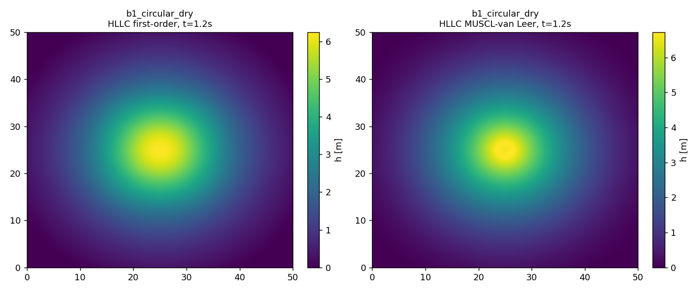
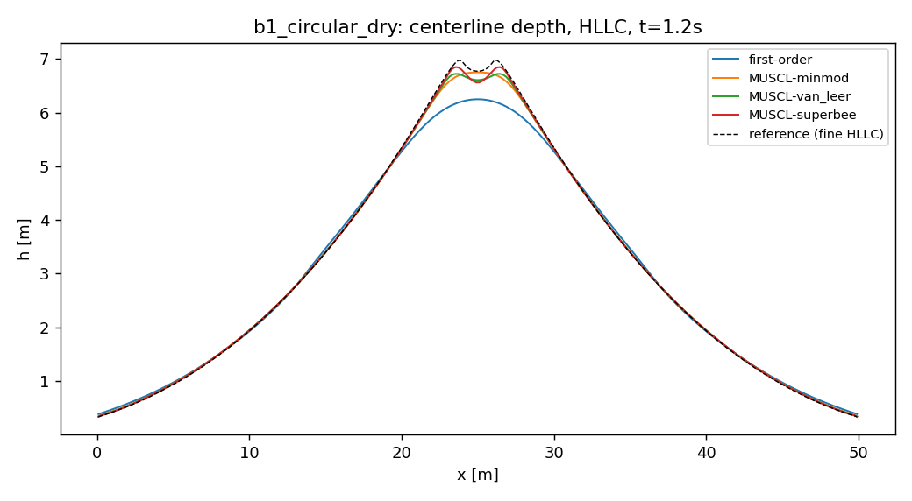
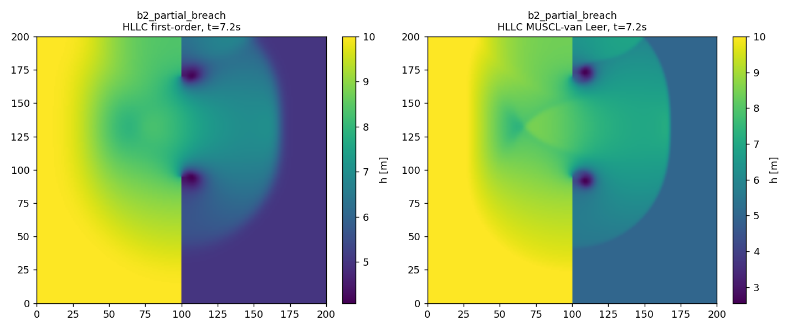
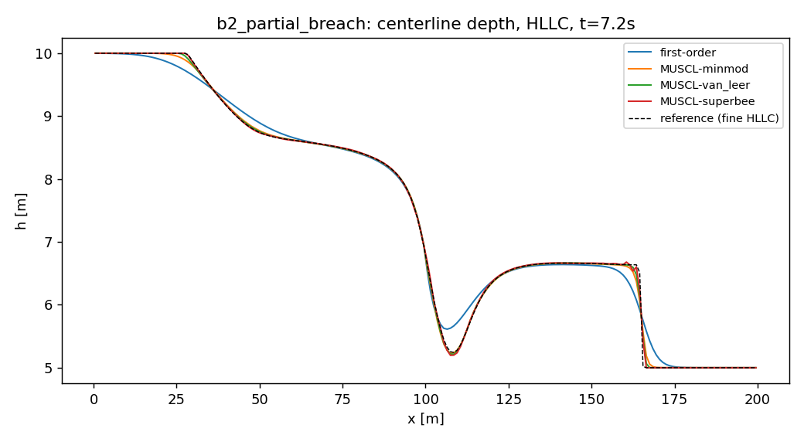
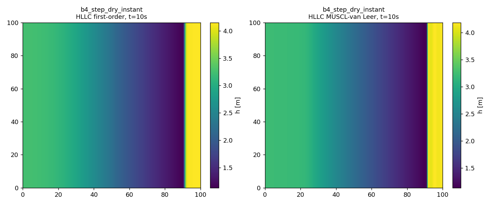
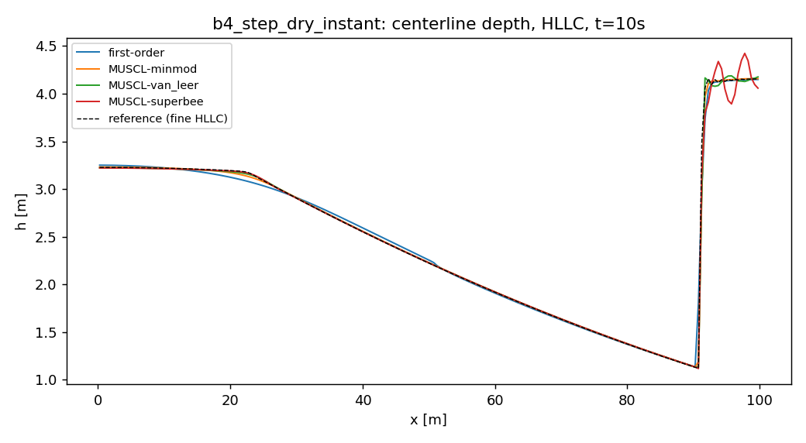

# 2D benchmark comparison (classical schemes)

Device: cuda. Generated by `experiments/run_classical.py` from `configs/classical_sweep.yaml`. Errors are vs a fine-grid HLLC MUSCL-van Leer self-convergence reference, at the final output time, L1/L2 over cell area. Runtimes are wall-clock for the full run.

## b1_circular_wet  (N=256, reference N=1024)

| scheme | reconstruction | L1(h) | L2(h) | L1(speed) | mass drift | wall t [s] | steps |
|---|---|---|---|---|---|---|---|
| rusanov | first-order | 2.713413e+02 | 1.078926e+01 | 6.635999e+02 | 6.66e-16 | 1.1047 | 173 |
| rusanov | MUSCL-minmod | 7.239991e+01 | 4.237197e+00 | 1.675533e+02 | 0.00e+00 | 1.5001 | 179 |
| rusanov | MUSCL-van_leer | 5.689483e+01 | 3.338622e+00 | 1.230700e+02 | 0.00e+00 | 1.2542 | 181 |
| rusanov | MUSCL-superbee | 5.717088e+01 | 3.053225e+00 | 1.361206e+02 | 0.00e+00 | 1.399 | 183 |
| hll | first-order | 1.748299e+02 | 8.005716e+00 | 4.607867e+02 | 1.11e-15 | 1.2607 | 178 |
| hll | MUSCL-minmod | 5.907441e+01 | 3.807187e+00 | 1.422600e+02 | 0.00e+00 | 1.5284 | 182 |
| hll | MUSCL-van_leer | 4.944856e+01 | 3.135824e+00 | 1.077977e+02 | 0.00e+00 | 1.5215 | 182 |
| hll | MUSCL-superbee | 4.539845e+01 | 2.739064e+00 | 1.003304e+02 | 0.00e+00 | 1.671 | 183 |
| hllc | first-order | 1.656706e+02 | 7.614982e+00 | 4.396593e+02 | 7.77e-16 | 1.9782 | 178 |
| hllc | MUSCL-minmod | 6.146283e+01 | 3.727926e+00 | 1.437287e+02 | 0.00e+00 | 2.2868 | 182 |
| hllc | MUSCL-van_leer | 5.243595e+01 | 3.101847e+00 | 1.120482e+02 | 0.00e+00 | 2.6317 | 182 |
| hllc | MUSCL-superbee | 4.919075e+01 | 2.702773e+00 | 1.046033e+02 | 0.00e+00 | 2.325 | 183 |

## b1_circular_dry  (N=256, reference N=1024)

| scheme | reconstruction | L1(h) | L2(h) | L1(speed) | mass drift | wall t [s] | steps |
|---|---|---|---|---|---|---|---|
| rusanov | first-order | 2.102944e+02 | 6.684837e+00 | 3.758913e+03 | 7.14e-03 | 1.1282 | 193 |
| rusanov | MUSCL-minmod | 4.724974e+01 | 1.458644e+00 | 1.017845e+03 | 1.39e-02 | 1.6942 | 224 |
| rusanov | MUSCL-van_leer | 3.876464e+01 | 1.152120e+00 | 4.161493e+02 | 1.51e-02 | 2.3186 | 233 |
| rusanov | MUSCL-superbee | 3.016000e+01 | 7.720121e-01 | 2.773031e+02 | 1.65e-02 | 2.1211 | 249 |
| hll | first-order | 1.059864e+02 | 4.219800e+00 | 2.172104e+03 | 1.32e-02 | 1.5341 | 205 |
| hll | MUSCL-minmod | 3.427070e+01 | 1.158872e+00 | 7.122513e+02 | 1.54e-02 | 1.9095 | 229 |
| hll | MUSCL-van_leer | 3.176476e+01 | 9.859226e-01 | 2.699837e+02 | 1.60e-02 | 2.0007 | 237 |
| hll | MUSCL-superbee | 2.996270e+01 | 7.787879e-01 | 2.727135e+02 | 1.65e-02 | 2.2657 | 250 |
| hllc | first-order | 1.001996e+02 | 4.028343e+00 | 2.078651e+03 | 1.27e-02 | 2.2833 | 205 |
| hllc | MUSCL-minmod | 3.521228e+01 | 1.174940e+00 | 7.001404e+02 | 1.52e-02 | 2.8953 | 229 |
| hllc | MUSCL-van_leer | 3.245109e+01 | 1.022341e+00 | 2.623043e+02 | 1.58e-02 | 2.9204 | 237 |
| hllc | MUSCL-superbee | 3.062441e+01 | 8.236765e-01 | 2.727596e+02 | 1.64e-02 | 3.2557 | 250 |

## b2_partial_breach  (N=200, reference N=800)

| scheme | reconstruction | L1(h) | L2(h) | L1(speed) | mass drift | wall t [s] | steps |
|---|---|---|---|---|---|---|---|
| rusanov | first-order | 3.531155e+03 | 4.394458e+01 | 5.061777e+03 | 0.00e+00 | 1.3732 | 201 |
| rusanov | MUSCL-minmod | 1.013512e+03 | 1.967208e+01 | 1.490907e+03 | 0.00e+00 | 1.7443 | 218 |
| rusanov | MUSCL-van_leer | 6.276870e+02 | 1.364587e+01 | 9.787021e+02 | 0.00e+00 | 1.8133 | 223 |
| rusanov | MUSCL-superbee | 5.302205e+02 | 1.010254e+01 | 1.036307e+03 | 0.00e+00 | 2.0005 | 233 |
| hll | first-order | 3.277013e+03 | 4.107296e+01 | 4.633569e+03 | 0.00e+00 | 1.6746 | 204 |
| hll | MUSCL-minmod | 9.005667e+02 | 1.708339e+01 | 1.312097e+03 | 2.22e-16 | 2.0817 | 220 |
| hll | MUSCL-van_leer | 5.524947e+02 | 1.193973e+01 | 8.662796e+02 | 0.00e+00 | 2.1963 | 225 |
| hll | MUSCL-superbee | 4.554331e+02 | 8.987365e+00 | 9.014605e+02 | 0.00e+00 | 2.3605 | 234 |
| hllc | first-order | 2.806705e+03 | 3.490438e+01 | 3.781914e+03 | 0.00e+00 | 2.5159 | 212 |
| hllc | MUSCL-minmod | 7.555698e+02 | 1.393288e+01 | 1.032566e+03 | 0.00e+00 | 2.9548 | 225 |
| hllc | MUSCL-van_leer | 4.725994e+02 | 1.018276e+01 | 7.056059e+02 | 0.00e+00 | 2.9679 | 229 |
| hllc | MUSCL-superbee | 4.098011e+02 | 8.086135e+00 | 7.062255e+02 | 0.00e+00 | 3.2321 | 236 |

## b3_three_humps  (N=300, reference N=600)

| scheme | reconstruction | L1(h) | L2(h) | L1(speed) | mass drift | wall t [s] | steps |
|---|---|---|---|---|---|---|---|
| rusanov | first-order | 1.179435e+02 | 4.133608e+00 | 6.892195e+02 | 2.22e-16 | 7.3981 | 1118 |
| rusanov | MUSCL-minmod | 7.930382e+01 | 3.102394e+00 | 5.250108e+02 | 2.22e-16 | 9.429 | 1194 |
| rusanov | MUSCL-van_leer | 7.746625e+01 | 2.968993e+00 | 5.284500e+02 | 2.22e-16 | 9.5666 | 1210 |
| rusanov | MUSCL-superbee | 8.043548e+01 | 3.220517e+00 | 5.229602e+02 | 2.22e-16 | 10.7786 | 1258 |
| hll | first-order | 1.073049e+02 | 3.854773e+00 | 6.394538e+02 | 0.00e+00 | 9.494 | 1140 |
| hll | MUSCL-minmod | 7.419339e+01 | 2.930372e+00 | 5.035173e+02 | 2.22e-16 | 11.2099 | 1201 |
| hll | MUSCL-van_leer | 7.389045e+01 | 2.818540e+00 | 5.080456e+02 | 1.11e-16 | 11.3325 | 1213 |
| hll | MUSCL-superbee | 7.224688e+01 | 2.813244e+00 | 4.830121e+02 | 0.00e+00 | 12.2531 | 1250 |
| hllc | first-order | 9.895228e+01 | 3.661271e+00 | 6.167359e+02 | 0.00e+00 | 13.4487 | 1161 |
| hllc | MUSCL-minmod | 8.023448e+01 | 3.107894e+00 | 5.239011e+02 | 2.22e-16 | 16.0053 | 1214 |
| hllc | MUSCL-van_leer | 6.723282e+01 | 2.751621e+00 | 4.272973e+02 | 1.11e-16 | 16.057 | 1223 |
| hllc | MUSCL-superbee | 5.569973e+01 | 2.209906e+00 | 3.471339e+02 | 2.22e-16 | 17.2694 | 1249 |

## b4_step_dry_instant  (N=200, reference N=800)

| scheme | reconstruction | L1(h) | L2(h) | L1(speed) | mass drift | wall t [s] | steps |
|---|---|---|---|---|---|---|---|
| rusanov | first-order | 6.302511e+02 | 1.224699e+01 | 1.624483e+03 | 0.00e+00 | 3.0999 | 484 |
| rusanov | MUSCL-minmod | 1.526247e+02 | 6.527920e+00 | 3.369909e+02 | 2.22e-16 | 3.9692 | 525 |
| rusanov | MUSCL-van_leer | 1.366365e+02 | 6.173118e+00 | 2.962462e+02 | 0.00e+00 | 4.1463 | 534 |
| rusanov | MUSCL-superbee | 1.628706e+02 | 5.674037e+00 | 3.518687e+02 | 2.22e-16 | 4.7743 | 552 |
| hll | first-order | 2.661412e+02 | 6.384382e+00 | 9.083002e+02 | 2.22e-16 | 4.4525 | 501 |
| hll | MUSCL-minmod | 8.314052e+01 | 3.621411e+00 | 1.998115e+02 | 2.22e-16 | 6.223 | 530 |
| hll | MUSCL-van_leer | 8.660471e+01 | 4.071138e+00 | 1.982072e+02 | 2.22e-16 | 5.8837 | 537 |
| hll | MUSCL-superbee | 1.507247e+02 | 6.370483e+00 | 2.482987e+02 | 0.00e+00 | 6.8307 | 553 |
| hllc | first-order | 2.757809e+02 | 7.118534e+00 | 9.478906e+02 | 2.22e-16 | 6.7364 | 501 |
| hllc | MUSCL-minmod | 8.972683e+01 | 3.836398e+00 | 2.156483e+02 | 3.33e-16 | 7.4588 | 530 |
| hllc | MUSCL-van_leer | 9.098653e+01 | 4.153144e+00 | 2.095834e+02 | 1.11e-16 | 7.6539 | 537 |
| hllc | MUSCL-superbee | 1.744703e+02 | 5.562052e+00 | 2.267190e+02 | 2.22e-16 | 8.1192 | 553 |

## B4 initial-condition matrix (HLLC MUSCL-van Leer, N=200)

Isolates the effect of the initial/breach configuration with a fixed high-quality scheme. 'progressive' opens the dam linearly over T_b=2 s; 'instant' removes it at t=0.

| case | mass drift | wall t [s] | steps |
|---|---|---|---|
| step_dry_instant | 1.11e-16 | 8.1384 | 537 |
| step_dry_progressive | 0.00e+00 | 8.414 | 565 |
| step_wet_instant | 2.22e-16 | 6.0365 | 428 |
| step_wet_progressive | 0.00e+00 | 6.7448 | 463 |
| cone_dry_instant | 0.00e+00 | 5.7141 | 400 |
| cone_dry_progressive | 0.00e+00 | 6.0021 | 400 |
| cone_wet_instant | 0.00e+00 | 5.3695 | 357 |
| cone_wet_progressive | 0.00e+00 | 5.5115 | 357 |

## Notes

- **Reconstruction dominates**: MUSCL cuts L1(h) by 3-5x over first-order on every benchmark; this is the largest single effect.
- **Scheme ordering** at fixed reconstruction: on the shear-bearing cases (B2 breach jet, B3) HLLC beats HLL beats Rusanov in L1(h) — the contact/shear wave restoration paying off. On the near-radial B1 the three are close (little shear), as expected.
- **Limiter trade-off**: superbee is sharpest and best on the smooth radial B1 and on B3, but it OVER-compresses on the strong planar step fronts of B4 (b4_step_dry: superbee L1 ~1.7e2 vs van_leer ~9e1), a clean illustration of its known steepening artifacts. Van Leer is the robust default.
- **Mass conservation**: closed-domain cases (B2, B3, B4 — reflective walls, incl. the internal breach wall) conserve to round-off (<=3e-16). B1 is transmissive: the wet case (front inside the domain at t_end) shows zero drift, while the dry case reaches the boundary and shows ~1.5% loss = physical outflow plus a small wet/dry positivity clamp contribution.
- **B3** exercises well-balancing + wet/dry + friction simultaneously; the still pools around the humps stay quiescent (no spurious currents) thanks to the hydrostatic reconstruction, and the tall central hump stays dry (water cannot climb 3 m).
- **Runtime**: HLLC costs ~1.4x Rusanov per step (extra star-state algebra); float64 on the RTX 5060 Ti is FP64-throttled, so these are conservative timings.
