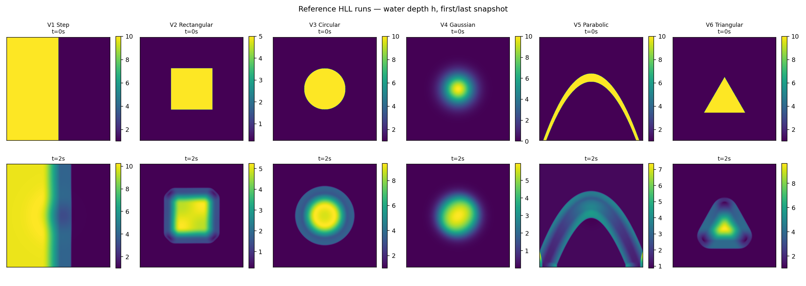
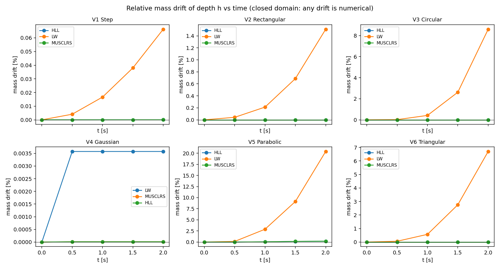

# Reference data audit — inventory and QC

Source: `data/` — 18 runs, 90 CSV snapshot files.

## Conventions (from paper/main.tex, verified numerically)

- Domain `[0,100] x [0,100]` m, 501×501 **nodes**, dx = dy = 0.2 m; T = 2 s, snapshots every 0.5 s.
- **g = 2.0 m/s²** (nonstandard — our reconciliation runs must match it), Manning n = 0.
- Bed topography: Gaussian hump `Z = 2 exp(-((x-50)² + (y-50)²)/200)`.
- **Reflective boundaries on all four sides** — the domain is closed, so any mass drift is numerical, not outflow.
- Schemes: Lax–Wendroff **with artificial viscosity**; HLL with `SL = min(uL-cL, uR-cR)`, `SR = max(uL+cL, uR+cR)`; MUSCL-RS = MUSCL (minmod, conserved variables) + Rusanov flux + SSP-RK3.
- **The stored field is the water depth `h`** -- the solver's actual output. (An earlier drop stored the free surface `eta = h + Z`, which the authors clarified on 2026-07-08 is only their plotting field.) Verified below: the t=0 snapshots equal the analytic `h_IC` to rounding in every run.

### Stored-field verification

Nodes where `h(t=0)` differs from the analytic `h_IC` by more than 1e-9 (out of 251,001), plus the max deviation over all remaining nodes. Mismatched nodes sit exactly on IC discontinuity loci (float rounding in the reference solver's inside/outside tests).

| run | mismatched nodes | max dev elsewhere |
|---|---|---|
| variant1-step-HLL | 0 | 0.000e+00 |
| variant1-step-LW | 0 | 0.000e+00 |
| variant1-step-MUSCLRS | 0 | 0.000e+00 |
| variant2-rectangular-HLL | 0 | 0.000e+00 |
| variant2-rectangular-LW | 0 | 0.000e+00 |
| variant2-rectangular-MUSCLRS | 0 | 0.000e+00 |
| variant3-circular-HLL | 2 | 0.000e+00 |
| variant3-circular-LW | 2 | 0.000e+00 |
| variant3-circular-MUSCLRS | 2 | 0.000e+00 |
| variant4-gaussian-LW | 0 | 8.438e-15 |
| variant4-gaussian-MUSCLRS | 1628 | 9.497e-10 |
| variant4-gaussian-HLL | 1628 | 9.497e-10 |
| variant5-parabolic-HLL | 0 | 0.000e+00 |
| variant5-parabolic-LW | 0 | 0.000e+00 |
| variant5-parabolic-MUSCLRS | 0 | 0.000e+00 |
| variant6-triangular-HLL | 0 | 0.000e+00 |
| variant6-triangular-LW | 0 | 0.000e+00 |
| variant6-triangular-MUSCLRS | 0 | 0.000e+00 |

## Inventory

All files are headerless CSV arrays of a **single field (water depth h) per snapshot**; momentum fields are absent. Times are parsed from filenames.

| run | variant IC | scheme | grid (ny×nx) | snapshots | t range [s] | h min @t0 | h max @t0 |
|---|---|---|---|---|---|---|---|
| variant1-step-HLL | Step | HLL | 501×501 | 5 | 0–2 | 1 | 10 |
| variant1-step-LW | Step | LW | 501×501 | 5 | 0–2 | 1 | 10 |
| variant1-step-MUSCLRS | Step | MUSCLRS | 501×501 | 5 | 0–2 | 1 | 10 |
| variant2-rectangular-HLL | Rectangular | HLL | 501×501 | 5 | 0–2 | 0.2 | 5 |
| variant2-rectangular-LW | Rectangular | LW | 501×501 | 5 | 0–2 | 0.2 | 5 |
| variant2-rectangular-MUSCLRS | Rectangular | MUSCLRS | 501×501 | 5 | 0–2 | 0.2 | 5 |
| variant3-circular-HLL | Circular | HLL | 501×501 | 5 | 0–2 | 1 | 10 |
| variant3-circular-LW | Circular | LW | 501×501 | 5 | 0–2 | 1 | 10 |
| variant3-circular-MUSCLRS | Circular | MUSCLRS | 501×501 | 5 | 0–2 | 1 | 10 |
| variant4-gaussian-LW | Gaussian | LW | 501×501 | 5 | 0–2 | 1.38879e-10 | 10 |
| variant4-gaussian-MUSCLRS | Gaussian | MUSCLRS | 501×501 | 5 | 0–2 | 1.6956e-10 | 10 |
| variant4-gaussian-HLL | Gaussian | HLL | 501×501 | 5 | 0–2 | 1.6956e-10 | 10 |
| variant5-parabolic-HLL | Parabolic | HLL | 501×501 | 5 | 0–2 | 1 | 10 |
| variant5-parabolic-LW | Parabolic | LW | 501×501 | 5 | 0–2 | 1 | 10 |
| variant5-parabolic-MUSCLRS | Parabolic | MUSCLRS | 501×501 | 5 | 0–2 | 1 | 10 |
| variant6-triangular-HLL | Triangular | HLL | 501×501 | 5 | 0–2 | 1 | 10 |
| variant6-triangular-LW | Triangular | LW | 501×501 | 5 | 0–2 | 1 | 10 |
| variant6-triangular-MUSCLRS | Triangular | MUSCLRS | 501×501 | 5 | 0–2 | 1 | 10 |

## QC diagnostics

All diagnostics are computed on the stored physical depth `h`. Mass drift is `sum(h)_t / sum(h)_0 − 1` (uniform grid, so cell area cancels). The paper states reflective BCs on all sides, so the domain is **closed** and any drift is a numerical conservation error of their scheme. Symmetry columns are relative L1 asymmetry under x-flip, y-flip, and 90° rotation at the final snapshot; they are meaningful for the radially symmetric ICs (variants [3, 4]), descriptive otherwise.

| run | max |mass drift| | min h over run | #h<0 | #NaN | time gaps | sym x-flip | sym y-flip | sym rot90 |
|---|---|---|---|---|---|---|---|---|
| variant1-step-HLL | 3.273e-07 | 9.547176e-01 | 0 | 0 | none | 1.375e+00 | 6.785e-17 | 7.920e-01 |
| variant1-step-LW | 6.631e-04 | 9.765179e-01 | 0 | 0 | none | 1.118e+00 | 9.508e-16 | 7.232e-01 |
| variant1-step-MUSCLRS | 2.848e-07 | 9.475278e-01 | 0 | 0 | none | 1.373e+00 | 2.654e-16 | 7.924e-01 |
| variant2-rectangular-HLL | 3.664e-15 | 1.989364e-01 | 0 | 0 | none | 5.276e-02 | 5.276e-02 | 5.276e-02 |
| variant2-rectangular-LW | 1.510e-02 | 1.948771e-04 | 0 | 0 | none | 2.573e-12 | 3.589e-12 | 3.569e-12 |
| variant2-rectangular-MUSCLRS | 3.775e-15 | 1.988179e-01 | 0 | 0 | none | 5.319e-02 | 5.319e-02 | 5.319e-02 |
| variant3-circular-HLL | 2.173e-08 | 1.000000e+00 | 0 | 0 | none | 1.379e-04 | 1.379e-04 | 1.379e-04 |
| variant3-circular-LW | 8.598e-02 | 1.000000e-04 | 0 | 0 | none | 3.275e-01 | 3.275e-01 | 3.275e-01 |
| variant3-circular-MUSCLRS | 4.552e-15 | 9.898488e-01 | 0 | 0 | none | 4.436e-02 | 4.436e-02 | 4.436e-02 |
| variant4-gaussian-LW | 3.575e-05 | 1.388794e-10 | 0 | 0 | none | 1.116e-15 | 1.108e-15 | 1.121e-15 |
| variant4-gaussian-MUSCLRS | 1.083e-07 | 1.695599e-10 | 0 | 0 | none | 7.787e-02 | 7.787e-02 | 7.787e-02 |
| variant4-gaussian-HLL | 1.085e-07 | 1.695599e-10 | 0 | 0 | none | 7.683e-02 | 7.683e-02 | 7.683e-02 |
| variant5-parabolic-HLL | 1.911e-03 | 8.721410e-01 | 0 | 0 | none | 1.267e-16 | 5.253e-01 | 5.000e-01 |
| variant5-parabolic-LW | 2.038e-01 | 1.000000e-04 | 0 | 0 | none | 1.097e-07 | 7.549e-01 | 7.109e-01 |
| variant5-parabolic-MUSCLRS | 2.048e-03 | 9.447640e-01 | 0 | 0 | none | 2.564e-02 | 5.337e-01 | 5.136e-01 |
| variant6-triangular-HLL | 2.850e-08 | 9.925454e-01 | 0 | 0 | none | 9.673e-17 | 5.430e-01 | 4.279e-01 |
| variant6-triangular-LW | 6.700e-02 | 1.138621e-04 | 0 | 0 | none | 3.237e-09 | 5.875e-01 | 4.836e-01 |
| variant6-triangular-MUSCLRS | 4.330e-15 | 9.455207e-01 | 0 | 0 | none | 3.227e-02 | 5.419e-01 | 4.337e-01 |

### Mass drift per snapshot

| run | t=0 | t=0.5 | t=1 | t=1.5 | t=2 |
|---|---|---|---|---|---|
| variant1-step-HLL | 0.000e+00 | 5.733e-09 | 2.766e-08 | 1.015e-07 | 3.273e-07 |
| variant1-step-LW | 0.000e+00 | 4.115e-05 | 1.667e-04 | 3.802e-04 | 6.631e-04 |
| variant1-step-MUSCLRS | 0.000e+00 | 5.474e-09 | 2.528e-08 | 9.002e-08 | 2.848e-07 |
| variant2-rectangular-HLL | 0.000e+00 | -1.443e-15 | -2.887e-15 | -3.664e-15 | -3.220e-15 |
| variant2-rectangular-LW | 0.000e+00 | 4.223e-04 | 2.123e-03 | 6.869e-03 | 1.510e-02 |
| variant2-rectangular-MUSCLRS | 0.000e+00 | -1.443e-15 | -2.887e-15 | -3.775e-15 | -3.553e-15 |
| variant3-circular-HLL | 0.000e+00 | 2.406e-09 | 6.806e-09 | 1.303e-08 | 2.173e-08 |
| variant3-circular-LW | 0.000e+00 | 2.024e-04 | 4.210e-03 | 2.621e-02 | 8.598e-02 |
| variant3-circular-MUSCLRS | 0.000e+00 | -1.998e-15 | -3.886e-15 | -4.552e-15 | -1.332e-15 |
| variant4-gaussian-LW | 0.000e+00 | 3.575e-05 | 3.575e-05 | 3.575e-05 | 3.575e-05 |
| variant4-gaussian-MUSCLRS | 0.000e+00 | 1.080e-07 | 1.081e-07 | 1.082e-07 | 1.083e-07 |
| variant4-gaussian-HLL | 0.000e+00 | 1.081e-07 | 1.082e-07 | 1.084e-07 | 1.085e-07 |
| variant5-parabolic-HLL | 0.000e+00 | 1.397e-05 | 4.922e-04 | 1.424e-03 | 1.911e-03 |
| variant5-parabolic-LW | 0.000e+00 | 1.450e-03 | 2.889e-02 | 9.123e-02 | 2.038e-01 |
| variant5-parabolic-MUSCLRS | 0.000e+00 | 1.660e-05 | 5.049e-04 | 1.564e-03 | 2.048e-03 |
| variant6-triangular-HLL | 0.000e+00 | 3.156e-09 | 8.926e-09 | 1.709e-08 | 2.850e-08 |
| variant6-triangular-LW | 0.000e+00 | 6.110e-04 | 5.720e-03 | 2.760e-02 | 6.700e-02 |
| variant6-triangular-MUSCLRS | 0.000e+00 | -2.109e-15 | -3.886e-15 | -4.330e-15 | 6.661e-16 |

## Key findings

- **Data hygiene is good**: no NaNs, no missing snapshots in any of the 18 runs; all grids are 501×501 with a uniform 0.5 s output cadence.
- **Stored field identified**: t=0 snapshots equal the analytic `h_IC` to float-rounding in all 18 runs (table above), confirming the files store the water depth h on the 501×501 node grid.
- **All runs are wet-bed**: the Gaussian variant's background depth decays to ~1.4e-11 at the corners but never reaches zero; no run exercises a true dry front. Our planned dry-bed benchmarks therefore have no reference-run counterpart.
- **LW mass drift is large and real**: with reflective (closed) boundaries, the LW runs lose up to 1.9e-1 (variant 5), 8.1e-2 (variant 3), 1.3e-2 (variant 2) of their volume — a conservation violation consistent with the paper's added artificial viscosity and the non-conservative FD form; worth discussing in the paper's comparison section.
- **Symmetry anomaly**: on the radially symmetric variants 3 and 4, LW stays symmetric to ~1e-8 while HLL and MUSCL-RS show O(1e-4)–O(6e-2) asymmetry at t=2 s — an upwind sweep-ordering or splitting asymmetry in their implementation. Flag to the solver authors.
- **HLL/MUSCL-RS conservation is exact** (~1e-15) on variants 2, 3, 6 but drifts to ~3e-7 (variant 1) and ~2e-3 (variant 5) on cases whose IC touches the reflective walls — pointing at their wall-flux treatment.
- **Well-balancing**: the paper discretizes the bed-slope source with centered differences (no hydrostatic reconstruction), so their schemes are not well-balanced over the hump; small spurious currents are expected in near-still regions. Our solver uses Audusse reconstruction, so residual differences of this type are *expected* in reconciliation and attributable to scheme, not convention.

## Remaining questions for the solver authors

1. **Momentum/velocity fields**: are `hu, hv` (or `u, v`) snapshots available? Without them, momentum metrics and momentum gauge data (for the FVM-informed PINN) cannot use these runs.
2. **Time step**: fixed dt or CFL-adaptive (which CFL)? Needed only for runtime comparisons, not accuracy.
3. **LW artificial viscosity**: form and coefficient (needed to attribute the LW mass loss precisely).
4. **Confirm the stored field is the depth h** (we verified this numerically; a one-line confirmation closes it).
5. **g = 2 m/s²**: confirm this is intentional (it is unusual; all cross-solver comparisons will use it for reconciliation, while our SWASHES-style validation uses g = 9.81).
