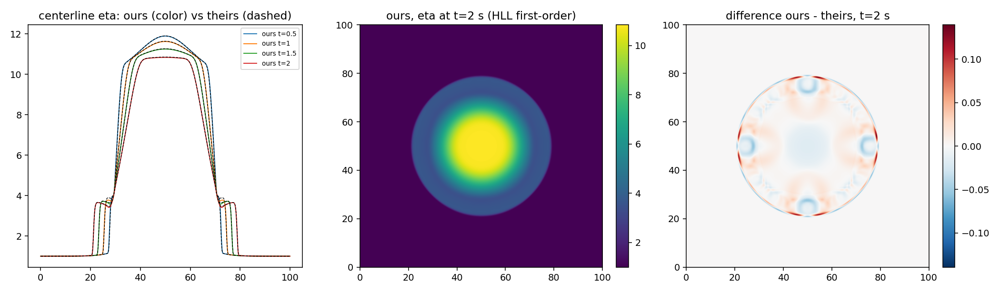

# Reconciliation vs reference variant 3 (circular dam break, HLL)

Setup: [0,100]^2 m, g = 2.0, Gaussian hump bed, reflective walls, T = 2 s. Their run: 501x501 nodes; ours: 500x500 cell centers (their nodes bilinearly sampled onto our centers). Comparison field: free surface eta.

## HLL first-order (matched) — 137 steps, 1.1 s wall (cuda)

| t [s] | L1 | L2 | Linf | rel. L1 |
|---|---|---|---|---|
| 0.5 | 2.6587e-03 | 1.2994e-02 | 3.1507e-01 | 0.13% |
| 1 | 2.9092e-03 | 1.0507e-02 | 1.4244e-01 | 0.14% |
| 1.5 | 3.1813e-03 | 9.7638e-03 | 1.5388e-01 | 0.16% |
| 2 | 3.1348e-03 | 8.9001e-03 | 1.3942e-01 | 0.17% |

## HLLC MUSCL-van Leer (ours, better) — 139 steps, 1.8 s wall (cuda)

| t [s] | L1 | L2 | Linf | rel. L1 |
|---|---|---|---|---|
| 0.5 | 2.1231e-02 | 8.8222e-02 | 8.2220e-01 | 1.01% |
| 1 | 2.7411e-02 | 9.2758e-02 | 7.7060e-01 | 1.36% |
| 1.5 | 3.0488e-02 | 9.3415e-02 | 7.4485e-01 | 1.57% |
| 2 | 3.2406e-02 | 9.2991e-02 | 7.0743e-01 | 1.75% |

## Interpretation

Known, quantified scheme differences (not convention mismatches):

1. **Source-term treatment**: ours is hydrostatic-reconstruction well-balanced; theirs applies -g h grad(Z) with centered differences. Their runs generate spurious currents in still regions over the hump, ours do not.
2. **Time integration**: SSP-RK2 (ours) vs SSP-RK3 (theirs), and our CFL-adaptive dt vs their (unknown) dt.
3. **Grid staggering**: cell-centered FV (ours) vs node FD-style (theirs); comparison interpolation contributes O(dx^2) near smooth regions and O(dx) at the shock.
4. **Numerical diffusion at the shock** dominates L_inf: both schemes use Davies-type wave-speed bounds, so the remaining front differences come from time integration (RK2 vs RK3), dt, and grid staggering.
