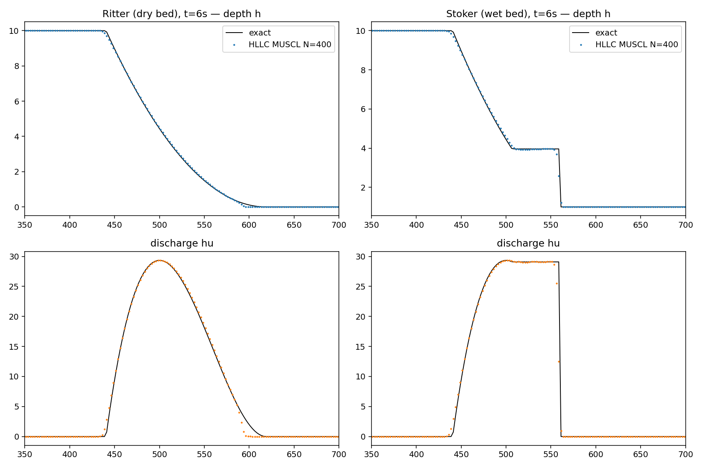
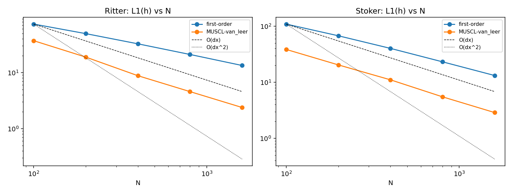

# Solver validation

Solver: well-balanced FV, SSP-RK2, CFL=0.45, float64; g = 9.81. Dam-break cases on [0,1000] m, dam at x=500 m, evaluated at t = 6 s. All numbers generated by `experiments/run_solver_validation.py`; unit tests in `tests/`.

## 1. Ritter dry-bed dam break — L1 refinement (h0=10 m)

**HLLC, first-order**

| N | L1(h) | order | L1(hu) | order |
|---|---|---|---|---|
| 100 | 7.3142e+01 | nan | 6.0227e+02 | nan |
| 200 | 4.9405e+01 | 0.57 | 3.7598e+02 | 0.68 |
| 400 | 3.2514e+01 | 0.60 | 2.5216e+02 | 0.58 |
| 800 | 2.0992e+01 | 0.63 | 1.7021e+02 | 0.57 |
| 1600 | 1.3352e+01 | 0.65 | 1.1080e+02 | 0.62 |

**HLLC, MUSCL-van_leer**

| N | L1(h) | order | L1(hu) | order |
|---|---|---|---|---|
| 100 | 3.6951e+01 | nan | 3.4268e+02 | nan |
| 200 | 1.8840e+01 | 0.97 | 1.7696e+02 | 0.95 |
| 400 | 8.7709e+00 | 1.10 | 7.9465e+01 | 1.16 |
| 800 | 4.5647e+00 | 0.94 | 4.1326e+01 | 0.94 |
| 1600 | 2.3779e+00 | 0.94 | 2.1545e+01 | 0.94 |

The dry front limits the observed order (locally first-order front treatment, exact solution has unbounded slope at the front), which is the expected behavior for wet/dry schemes.

## 2. Stoker wet-bed dam break — L1 refinement (10 m -> 1 m)

**HLLC, first-order**

| N | L1(h) | order | L1(hu) | order | shock err [m] | cells |
|---|---|---|---|---|---|---|
| 100 | 1.0929e+02 | nan | 7.8231e+02 | nan | 0.320 | 0.03 |
| 200 | 6.7616e+01 | 0.69 | 4.8391e+02 | 0.69 | 0.298 | 0.06 |
| 400 | 4.0288e+01 | 0.75 | 2.9360e+02 | 0.72 | 0.169 | 0.07 |
| 800 | 2.3187e+01 | 0.80 | 1.6451e+02 | 0.84 | 0.044 | 0.03 |
| 1600 | 1.3219e+01 | 0.81 | 9.4102e+01 | 0.81 | 0.114 | 0.18 |

**HLLC, MUSCL-van_leer**

| N | L1(h) | order | L1(hu) | order | shock err [m] | cells |
|---|---|---|---|---|---|---|
| 100 | 3.8558e+01 | nan | 2.8596e+02 | nan | 1.164 | 0.12 |
| 200 | 2.0445e+01 | 0.92 | 1.4476e+02 | 0.98 | 0.036 | 0.01 |
| 400 | 1.1077e+01 | 0.88 | 8.2728e+01 | 0.81 | 0.013 | 0.01 |
| 800 | 5.5038e+00 | 1.01 | 3.4812e+01 | 1.25 | 0.039 | 0.03 |
| 1600 | 2.8853e+00 | 0.93 | 1.7839e+01 | 0.96 | 0.026 | 0.04 |

### Cross-scheme comparison at N=400 (Stoker, L1(h) and shock error)

| scheme | order/limiter | L1(h) | shock error [cells] |
|---|---|---|---|
| rusanov | first-order | 4.9913e+01 | 0.23 |
| rusanov | MUSCL-minmod | 1.6331e+01 | 0.08 |
| rusanov | MUSCL-van_leer | 1.2574e+01 | 0.05 |
| rusanov | MUSCL-superbee | 1.0751e+01 | 0.06 |
| hll | first-order | 3.8904e+01 | 0.13 |
| hll | MUSCL-minmod | 1.3497e+01 | 0.06 |
| hll | MUSCL-van_leer | 9.5679e+00 | 0.04 |
| hll | MUSCL-superbee | 7.9133e+00 | 0.07 |
| hllc | first-order | 4.0288e+01 | 0.07 |
| hllc | MUSCL-minmod | 1.4476e+01 | 0.04 |
| hllc | MUSCL-van_leer | 1.1077e+01 | 0.01 |
| hllc | MUSCL-superbee | 9.5193e+00 | 0.02 |

## 3. Well-balance (lake at rest, hydrostatic reconstruction)

1D SWASHES bump, 100 s, N=200, HLLC MUSCL-van Leer:

| t [s] | max u [m/s] | max hu | max dh vs t=0 |
|---|---|---|---|
| 10 | 6.544e-16 | 2.118e-16 | 1.110e-16 |
| 20 | 1.396e-15 | 5.773e-16 | 1.110e-16 |
| 30 | 9.485e-16 | 2.862e-16 | 1.110e-16 |
| 40 | 9.650e-16 | 4.514e-16 | 1.110e-16 |
| 50 | 1.735e-15 | 5.370e-16 | 1.110e-16 |
| 60 | 2.009e-15 | 7.236e-16 | 4.441e-16 |
| 70 | 3.926e-15 | 1.309e-15 | 2.220e-16 |
| 80 | 1.706e-15 | 8.530e-16 | 3.331e-16 |
| 90 | 1.734e-15 | 6.316e-16 | 4.441e-16 |
| 100 | 4.873e-15 | 2.377e-15 | 6.661e-16 |

2D lake over the Gaussian hump (100x100, reflective, 20 s): max hu = 5.594e-14, max hv = 5.594e-14.

## 4. Mass conservation

Closed reflective box, 256x256 circular dam break over the hump, 5 s (365 steps): max relative volume drift = **0.000e+00**.

## 5. Positivity

Ritter N=400 MUSCL-van Leer, all snapshots: min h = 0.000e+00 (never negative; asserted in tests as well).

## 6. Runtime, 512x512, HLLC MUSCL-van Leer, float64

| device | s / step |
|---|---|
| cpu | 0.1075 |
| cuda (NVIDIA GeForce RTX 5060 Ti) | 0.0128 |

(No torch.compile yet; eager float64. Kernels are compile-compatible by construction — a follow-up optimization.)
